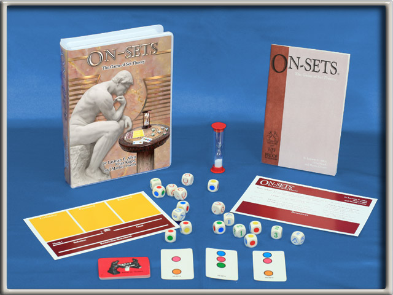

# On-Sets Front End

#### The game of Set Theory

> Game Created by Layman Allen

---

## --- About ---

On-Sets is a logic game based on set theory. It is part of a larger collection of games, 'Academic Games',
which features other games in grammar, mathematics, and trivia. On-Sets is a game where 3 players take turns moving cubes,
in an attempt to write a formula to solve an arbitrary goal based on data presented on cards. The game is played competitively in
Middle and High Schools across the US. Visit the [Academic Games League of America](http://agloa.org/on-sets/)
website to learn more.

## --- Rules of the Game ---

For a complete description of all of the rules for On-Sets, see the docs: [On-Sets](./documents/on-sets/onsets_rules.pdf)

## --- Environments ---

* Dev
* Staging TODO
* Production TODO

## --- Routes---

Routes are rendered with React Router V4, declared inline (not in a config file).
See the [React Router Docs](https://reacttraining.com/react-router/web/guides/philosophy) for more.
(the docs are pretty good)
